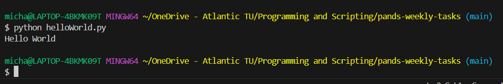
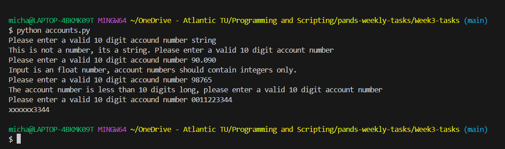

# pands-weekly-tasks 2023

## Student Name: Michael Curley


## Table of Contents.

* [Week 01 - Hello World](#week-01---hello-world)
* [Week 02 - Bank](#week-02---bank)
* [Week 03 - Accounts](#week-03---accounts)
* [Week 04 - Collats](#week-04---collatz)
* [Week 05 - Weekday](#week-05---weekday)
* [Week 06 - Square root](#week-06---squareroot)
* [Week 07 - Es](#week-07---es)


### ***Week 01 - Hello World***

The Hello World program is a traditional first step when learing a new programming language. It allows us to confirm that we have downloaded and setup the tools that we will require over the duration of the course of study, such as [cmder](https://cmder.app/) and [Visual Studio Code](https://code.visualstudio.com/). We created a simple program called helloWorld.py, which basically output the words "Hello World" in the terminal window once the program was run.



- - - -
### ***Week 02 - Bank***

>When Banks are storing currency figures, they store them as integers (usually in cent).This is to avoid rounding errors. 
>Write a program called bank.py
>The program should
>1. Prompt the user and read in two money amounts (in cent).
>2. Add the two amounts.
>3. Print out the amount in a human readable format with a euro sign and decimal point between the euro and cent of the amount.

The user is asked "Enter amount1(in cent)", and then to "Enter amount 2(in cent). To ensure we are not recieving string inputs or floating point inputs the values are cast to integers in pyton using the [int()](https://www.w3schools.com/python/python_casting.asp). The two inputs are then added together to find the total amount in cents, which will be converted to euros by either of two methods. The first method is not recommended as dealing with floats in python can produce some undesirable results. 

Method 2 is the recommended way of dealing with this type of problem in python. Here we are using [floor division](https://stackoverflow.com/questions/183853/what-is-the-difference-between-and-when-used-for-division), and the [modulus operator](https://realpython.com/python-modulo-operator/). The floor division divides the first amount by the second amount and rounds the result down to the nearest whole number. This will give us our euro part of the solution. The modulus operator will return the remainder of dividing the first amount by the second amount, and will therefore compute the cent equivalent. 


<details>
            <summary>Running the program</summary>

<p>

```
$ python bank.py
```
User Input:
```
Enter amount1(in cent): 65
Enter amount2(in cent): 180
```
Terminal Output:
```
The sum of these is €2.45
```

</p>

</details>

- - - - 
### ***Week 03 - Accounts***

>Bank account numbers can be stored as 10 character strings, for security reasons some applications only display 
>the last 4 characters (with the other other characters replaced with Xs).
>Write a python program called accounts.py that reads in a 10 character account number and outputs the
>account number with only the last 4 digits showing (and the first 6 digits replaced with Xs).



<details>
            <summary>Running the program</summary>

<p>

```
$ python accounts.py
```
User Input:
```
Please enter a 10 digit account number: 1234567890
```
Terminal Output:
```
xxxxxx7890
```

</p>

</details>

- - - - 

### ***Week 04 - Collatz***

>Write a program, called collatz.py, that asks the user to input any positive integer and outputs the successive values of the following calculation.
>At each step calculate the next value by taking the current value and, if it is even, divide it by two, but if it is odd, multiply it by three and add one.
>Have the program end if the current value is one.

The above problem is known as the [Collatz Conjecture](https://en.wikipedia.org/wiki/Collatz_conjecture), one of the most famous unsolved problems in mathematics. The conjecture asks whether repeating two simple arithmetic operations will eventually transfrom every positive integer into 1.

The user is asked "Please enter a positive integer" to start, which will be stored in the variable number. A if statement is used to confirm that the user has actually entered a positive number. If the user has not entered a positive integer, the program will prompt the user "That is not a positive number, Please try again", and ask the user to "Please enter a positive number" again. 

Once a positive integer has being entered this will be appended to our list allNumber, as the start of our collatz series. 

A while statement is then used to complete either of the two mathematical calculations on the current number while the number is not equal to 1, and apend the new result to our list. The result will be stored in our variable number, and the program will continue until the result of the calculations in the if/else loop result in 1.

When we reach 1 all the numbers in the list which make up our collatz conjecture for the number the user entered, will be printed to the screen, along with the message "You have reached one, that is the end of the series. Thank you for playing".


<details>
            <summary>Running the program</summary>

<p>

```
$ python collatz.py
```
User Input:
```
Please enter a positive integer: 10
```
Terminal Output:
```
10 5 16 8 4 2 1
```
</p>

</details>


- - - - 

### ***Week 05 - Weekday***

>Write a program that outputs whether or not today is a weekday. The program should be called weekday.py
>Search the web to find out how you work out what day it is in python

The [datetime module](https://docs.python.org/3/library/datetime.html#module-datetime) was used in order to manipulate the date and time in this programme. A good reference on using the module to manipulate the date and time can be found on the [note.nkmk.me](https://note.nkmk.me/en/python-datetime-now-today/) website. The program does not require any input from the user, it determines the current date, and then determines what day of the week it is from this. The module can return the current day in various forms, but I have chosen to return the day using its full Weekday name. An if statement then determines whether the day is a weekday or a day of the weekend. The program has been tested on a weekday and during the weekend to ensure that it works in both cases.


<details>
            <summary>Running the program</summary>

<p>
Example of program running on a Thursday is given below

```
$ python weekday.py
```
```
Yes, unfortunately today is a Weekday
```
Example of program running on a Saturday is as follows

```
$ python weekday.py
```
```
It is the Weekend, yah!
```

</p>

</details>


- - - - 

### ***Week 06 - Squareroot***

>Write a program that takes a positive floating-point number as input and outputs an approximation of its square root.
>You should create a function called sqrt() that does this.

In order to be able to complete this program, we had to become familiar with the [Newton Method](https://en.wikipedia.org/wiki/Newton%27s_method). This in itself was a very time consuming task, and required a lot of research. Along with the above link, I found the following [YouTube Video](https://www.youtube.com/watch?v=gNb-H50zmRY) a great source of information to fully understand this method. [Stack overflow](https://stackoverflow.com/questions/28733759/python-square-function-using-newtons-algorithm) also gives an excellent overview from a progmamming point of view of implementing the newton method in the Python programming language.

Ultimately, to find the square root of a positive floating point number required implementing the mathematical formula which has being derived to approximate the square root of any positive number.

A while loop has being used to ensure that a positive number(n) is entered, and a try/catch block is used to ensure that the program can deal with negitive numbers and strings. The program is designed to ask the user for the number of iterations(i) that they would like to approximate the square root to. You can enter as many iterations as you would like. Perhaps, another approach that could have being taken would have being to keep approximating the root until the new approximation is equal to the last approximation within a number of decimal places. 


<details>
            <summary> Running the program</summary>
<p>
           
```
$ python squareroot.py
```
User Input:
```
Please enter a positive number: 14.5
```
Terminal Output:
```
The square root of 14.5 is approx. 3.8
```

</p>

</details>

- - - - 


### ***Week 07 - Es***

>Write a program that reads in a text file and outputs the number of e's it contains.
>The program should take the filename from an argument on the command line.

This program has been designed to read a text file called by the user from the command line. In order to do this we have made the assumption that the file will be in the same directory as the program that is reaing the number of 'e's it contains. I have downloaded a copy of Dante's Divine Comedy and added this to the same diretory as the program for testing purposes. This file is saved as DivineComedy-Dante.txt. The [sys module](https://docs.python.org/3/library/sys.html) module provides access to some variables used or maintained by the interpreter and to functions that interact strongly with the interpreter. It is always available. The submodule sys.argv deals with command line arguments passed to a Python script. The sys.argv[0] contains the python script name, and therefore the text filename needs to be held in the second argument sys.argv[1]. I found the [Tutorials Point](#https://www.tutorialspoint.com/python/python_command_line_arguments.htm) website an invaluable resourse when completing this task. The website describe the sys module in great details.

We need to import the sys module into our program in order to use its functionality. 


<details>
            <summary> Running the program</summary>
<p>
           
```
$ python es.py DivineComedy-Dante.txt
```

Terminal Output:
```
The file DivineComedy-Dante.txt contains 8334 'e's
```

</p>

</details>

- - - - 